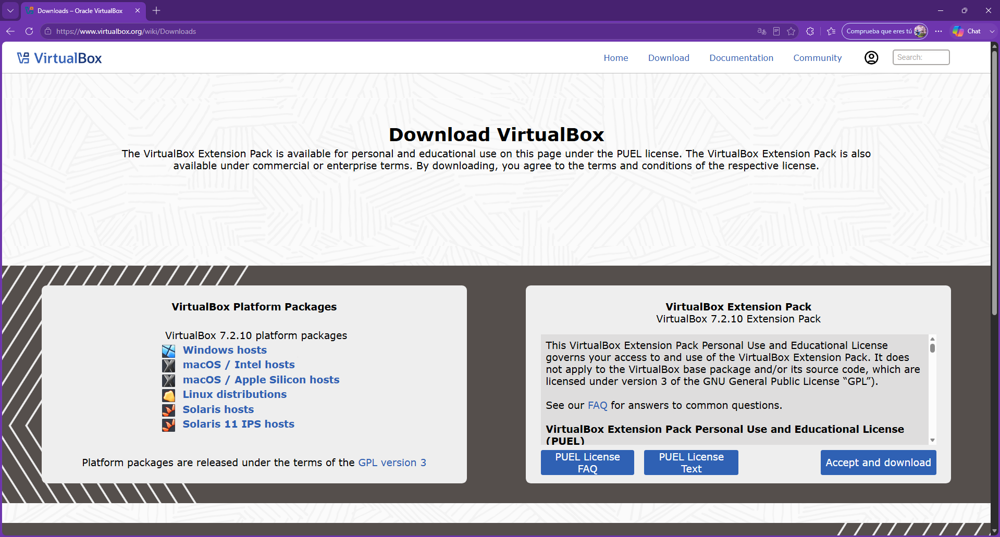
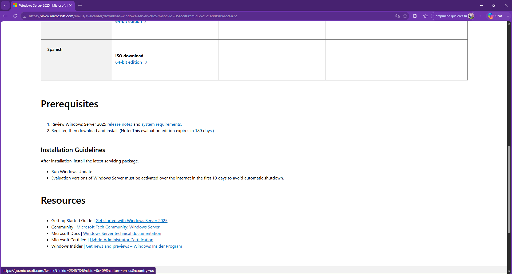
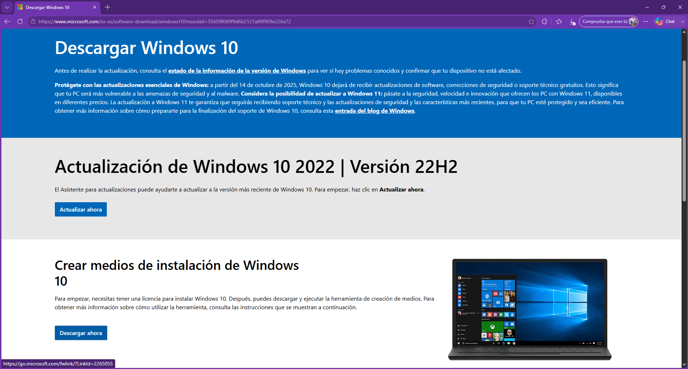
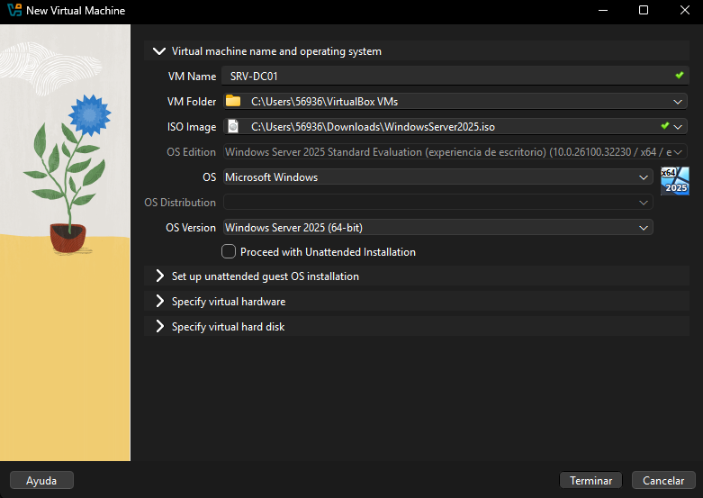
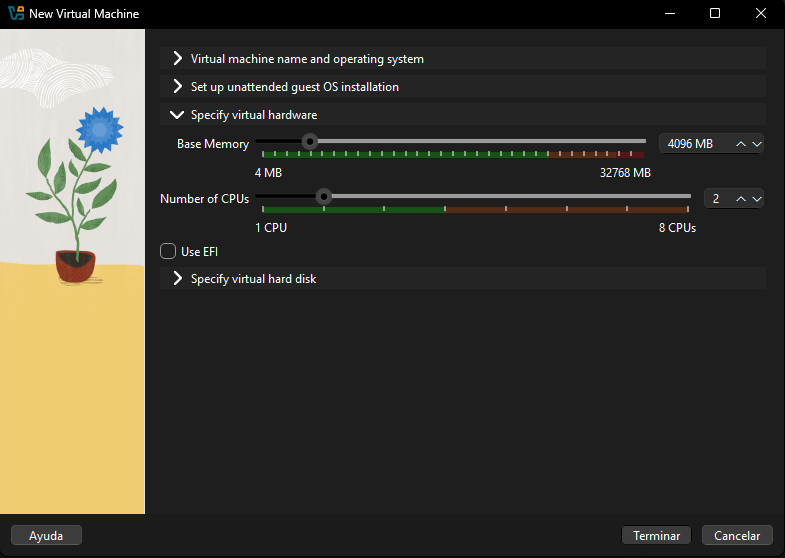
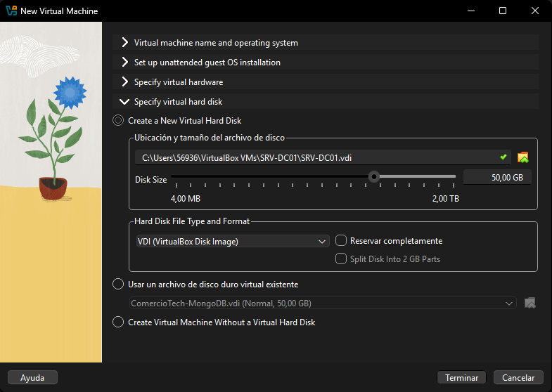
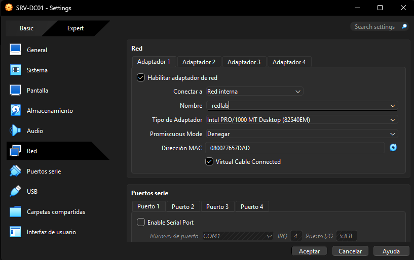

# Instalación y configuración básica del servidor

## Objetivo de la sección

En esta sección se documenta la instalación y configuración inicial del servidor que será utilizado como base del laboratorio de Windows Server.

El servidor se configura como una máquina virtual en VirtualBox, con el sistema operativo **Windows Server 2025**, conectado a una red interna llamada `redlab`. Además, se asigna un nombre de equipo, una dirección IP fija y se verifica el estado del firewall.

Esta configuración es necesaria para que el servidor pueda cumplir posteriormente los roles de **Active Directory**, **DNS** y **DHCP** dentro del dominio `inacap.local`.

---

## Requisitos previos

Debemos de tener instalado previamente la aplicación VirtualBox para emular tanto el servidor como el PC del usuario que se conectará.

Link oficial de VirtualBox: https://www.virtualbox.org/wiki/Downloads

Adicionalmente tener en nuestro dispositivo las ISO de Windows Server 2025 y Windows 10 Pro para la instalación, configuración y uso de las mismas desde VirtualBox.

Link oficial de Windows Server 2025: https://www.microsoft.com/en-us/evalcenter/download-windows-server-2025?msockid=35659f089f9d6b2121a88f909e226a72

Link oficial de Windows 10 Pro (usando MediaCreationTool_22H2.exe): https://www.microsoft.com/es-es/software-download/windows10?msockid=35659f089f9d6b2121a88f909e226a72

---

## Datos generales del servidor

| Elemento              | Configuración                      |
| --------------------- | ---------------------------------- |
| Máquina virtual       | Servidor                           |
| Nombre del equipo     | `SRV-DC01`                         |
| Sistema operativo     | Windows Server 2025                |
| Tipo de red           | Red interna VirtualBox             |
| Nombre de red interna | `redlab`                           |
| Dirección IP          | `192.168.10.10`                    |
| Máscara de subred     | `255.255.255.0`                    |
| Puerta de enlace      | Sin configurar                     |
| DNS preferido         | `127.0.0.1`                        |
| Función esperada      | Servidor principal del laboratorio |

---

## Paso a Paso Configuración VirtualBox

Se creó una máquina virtual en VirtualBox para instalar el sistema operativo Windows Server 2025.

La máquina virtual fue configurada con los recursos necesarios para ejecutar el servidor dentro del laboratorio, incluyendo memoria RAM, almacenamiento dinámico y una tarjeta de red conectada a una red interna.

Paso a Paso:

1) Asignamos la maquina de nombre `SRV-DC01` y seleccionamos la unidad ISO de Windows Server 2025

2) Indicamos la memoria RAM (4GB) y los núcleos de la CPU (2)

3) Indicamos la memoria de disco duro (50 GB)

4) Configuramos la red interna de nombre `redlab`

---

## Paso a Paso Instalación de Windows Server 2025

Se inició la máquina virtual utilizando la imagen ISO de Windows Server 2025.

Durante la instalación se seleccionó la edición con experiencia de escritorio, ya que esta permite trabajar con una interfaz gráfica para administrar el servidor de forma más sencilla.

Al finalizar la instalación, se configuró la contraseña del usuario administrador local.

WIP - Imagenes Paso a Paso

---

## Paso a Paso Cambio de nombre del equipo

Luego de instalar el sistema operativo, se modificó el nombre del equipo servidor `SRV-DC01`.

Este nombre permite identificar claramente al servidor principal del laboratorio, el cual será utilizado como controlador de dominio.

Después de aplicar el cambio de nombre, se reinició el sistema para que la configuración quedara activa.

WIP - Imagenes Paso a Paso

---

## Paso a Paso Configuración de red

Se configuró una dirección IP fija en el adaptador de red del servidor.

La configuración aplicada fue la siguiente:

| Parámetro         | Valor           |
| ----------------- | --------------- |
| Dirección IP      | `192.168.10.10` |
| Máscara de subred | `255.255.255.0` |
| Puerta de enlace  | Vacía           |
| DNS preferido     | `127.0.0.1`     |

La dirección IP fija es importante porque el servidor entregará servicios de red al dominio, por lo tanto, debe mantener siempre la misma dirección.

El DNS preferido se configuró como `127.0.0.1`, ya que el servidor se utilizará posteriormente como servidor DNS del dominio.

WIP - Imagenes Paso a Paso

---

## Paso a Paso Verificación del firewall

Se verificó que el firewall de Windows se encontrara activado.

El firewall se mantiene habilitado para conservar la seguridad del servidor. Posteriormente, los roles instalados en Windows Server abrirán los puertos necesarios según los servicios configurados.

WIP - Imagenes Paso a Paso

---

## Resultado de la configuración

Al finalizar esta etapa, el servidor quedó instalado y configurado con los parámetros iniciales requeridos para continuar con el laboratorio.

El equipo `SRV-DC01` quedó preparado para la instalación de los roles de servidor, principalmente Active Directory, DNS y DHCP, los cuales permitirán crear y administrar el dominio `inacap.local`.
