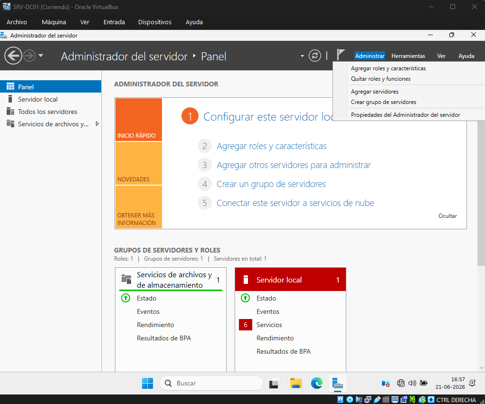
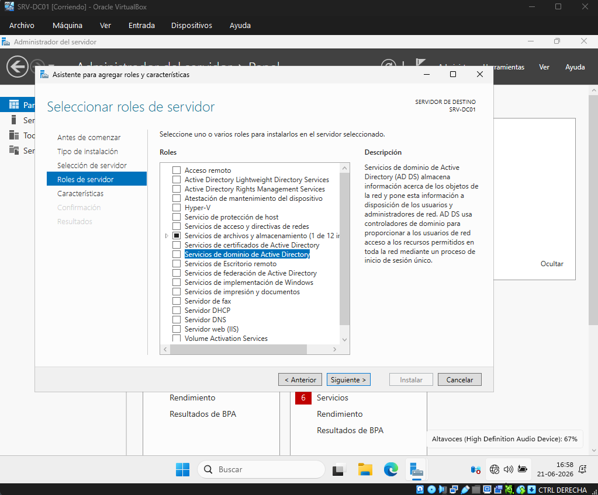
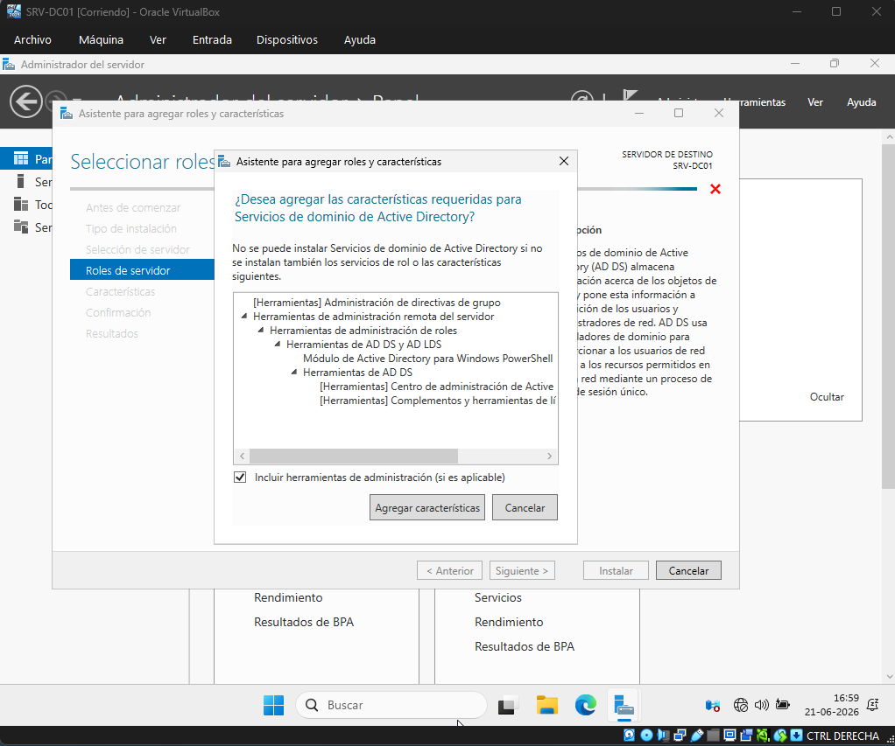
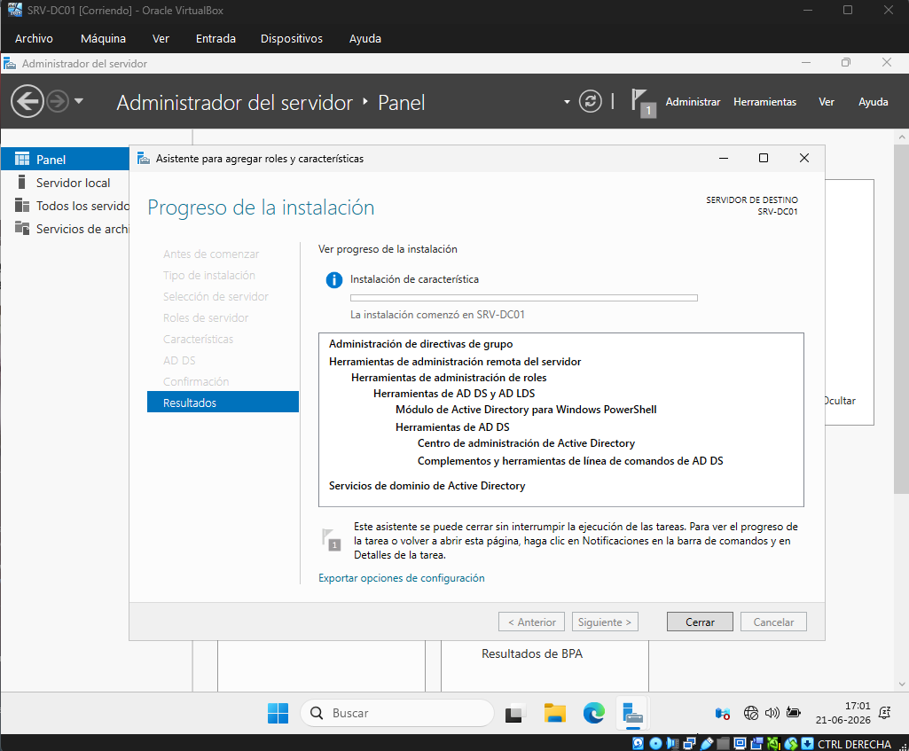
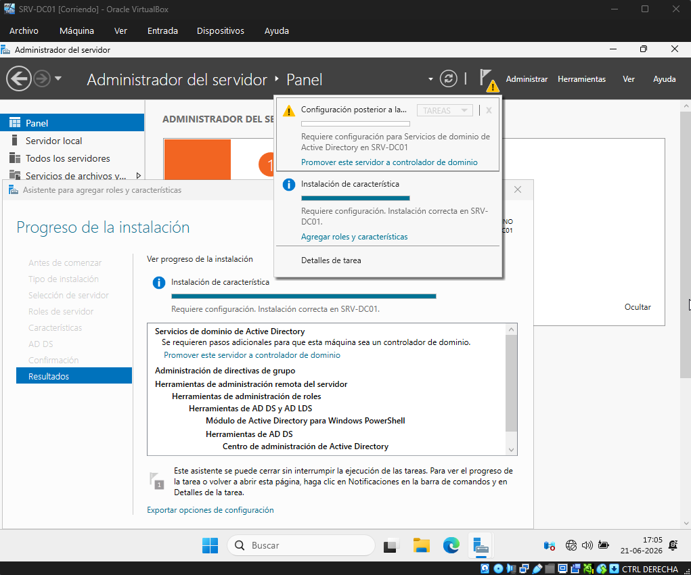
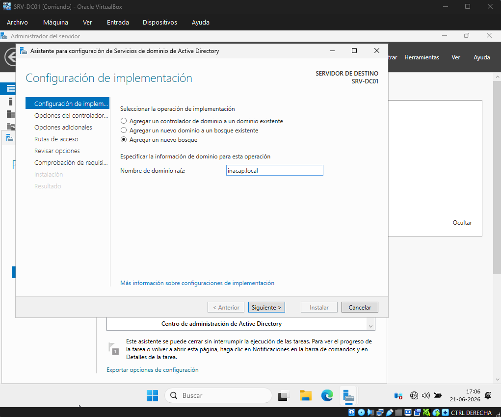
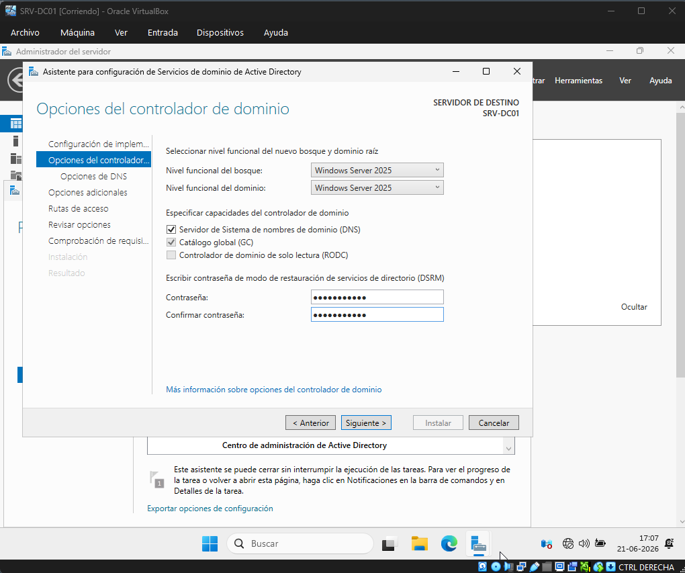
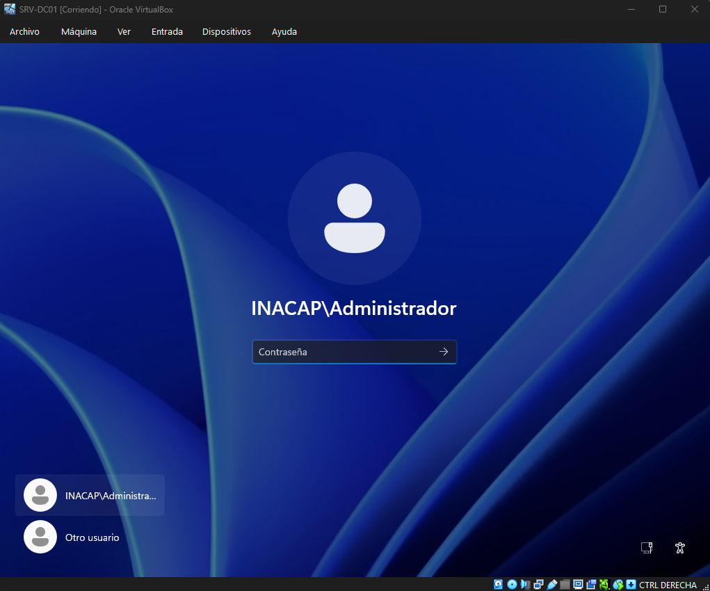

# Active Directory y objetos del dominio

## Objetivo de la sección

En esta sección se documenta la instalación y configuración inicial de **Active Directory Domain Services (AD DS)** en el servidor `SRV-DC01`.

El objetivo es transformar el servidor en un **controlador de dominio**, creando el dominio `inacap.local` y configurando los objetos principales del dominio, como unidades organizativas, usuarios y grupos.

Esta configuración permite administrar de forma centralizada los recursos, usuarios, equipos y políticas dentro de la red del laboratorio.

---

## Datos generales de Active Directory

| Elemento            | Configuración                             |
| ------------------- | ----------------------------------------- |
| Servidor            | `SRV-DC01`                                |
| Sistema operativo   | Windows Server 2025                       |
| Rol principal       | Active Directory Domain Services          |
| Dominio creado      | `inacap.local`                            |
| Tipo de dominio     | Nuevo bosque                              |
| DNS                 | Instalado automáticamente junto con AD DS |
| Unidad organizativa | `Ventas`                                  |
| Grupo               | `G-Ventas`                                |
| Usuario principal   | `priveros`                                |

---

## Paso a Paso Instalación del rol AD DS

Desde el **Administrador del servidor**, se ingresó a la opción **Administrar** y luego a **Agregar roles y características**.

En el asistente de instalación se seleccionó el rol **Servicios de dominio de Active Directory (AD DS)**. Este rol permite que el servidor administre un dominio, usuarios, grupos, equipos y otros objetos de red.

Al finalizar la instalación del rol, el dominio aún no queda creado, ya que primero es necesario promover el servidor como controlador de dominio.

Paso a Paso:

1. Desde el **Administrador del servidor**, se ingresa a la opción **Administrar** y luego se selecciona **Agregar roles y características**.

2. En la sección **Roles del servidor**, se selecciona la opción **Servicios de dominio de Active Directory**.

3. Se validan las características adicionales que serán incorporadas y se selecciona la opción **Agregar características**.

4. Se selecciona la opción **Instalar** para iniciar el proceso de instalación del rol **AD DS**.

---

## Paso a Paso Promoción del servidor a controlador de dominio

Luego de instalar el rol AD DS, se utilizó la notificación del Administrador del servidor para iniciar la promoción del servidor.

Se seleccionó la opción **Agregar un nuevo bosque** y se definió como nombre de dominio raíz `inacap.local`.

Durante este proceso, Windows Server instaló y configuró automáticamente el servicio DNS, ya que Active Directory lo requiere para resolver los nombres del dominio.

Después de completar la configuración, el servidor se reinició y quedó habilitado como controlador de dominio.

Paso a Paso:

1. Una vez finalizada la instalación del rol **AD DS**, se selecciona la notificación del **Administrador del servidor** y luego la opción **Promover este servidor a controlador de dominio**.

2. Se selecciona la opción **Agregar un nuevo bosque** y se define el dominio raíz con el nombre `inacap.local`.

3. Se ingresa la contraseña para el modo de restauración de servicios de directorio y se continúa con el asistente hasta completar correctamente la configuración.

---

## Paso a Paso Validación del dominio

Después del reinicio, se inició sesión utilizando el formato del dominio `INACAP\Administrador`.

Esto permitió validar que el servidor ya formaba parte del dominio `inacap.local` y que Active Directory se encontraba activo.

Desde este punto, el servidor quedó preparado para administrar usuarios, grupos, equipos y unidades organizativas dentro del dominio.

Paso a Paso:

1. Para validar que el dominio fue configurado correctamente, se inicia sesión nuevamente en el servidor y se verifica que el dominio **INACAP** aparezca disponible en la pantalla de inicio de sesión.

---

## Paso a Paso Creación de unidad organizativa

Desde **Administrador del servidor**, se accedió a Herramientas → Usuarios y equipos de Active Directory.

Dentro del dominio `inacap.local`, se creó una unidad organizativa llamada `Ventas`:

La unidad organizativa permite ordenar los objetos del dominio y facilita la administración de usuarios, grupos y políticas de grupo.

WIP - Imágenes Paso a Paso

---

## Paso a Paso Creación de usuarios

Dentro de la unidad organizativa `Ventas`, se crearon usuarios del dominio.

El usuario principal creado para el laboratorio fue `priveros`:

Durante la creación del usuario se configuró una contraseña inicial y, para fines del laboratorio, se desmarcó la opción de cambiar contraseña en el próximo inicio de sesión.

Esto permite que el usuario pueda iniciar sesión directamente en el equipo cliente cuando este sea incorporado al dominio.

WIP - Imágenes Paso a Paso

---

## Paso a Paso Creación de grupo

Dentro de la unidad organizativa `Ventas`, se creó el grupo `G-Ventas`:

Posteriormente, se agregaron los usuarios correspondientes como miembros del grupo.

El grupo permite administrar permisos y políticas de forma más ordenada, aplicando configuraciones a varios usuarios en lugar de hacerlo individualmente.

WIP - Imágenes Paso a Paso

---

## Resultado de la configuración

Al finalizar esta etapa, el servidor `SRV-DC01` quedó configurado como controlador de dominio del laboratorio.

Además, se creó el dominio `inacap.local`, la unidad organizativa `Ventas`, usuarios del dominio y el grupo `G-Ventas`.

Esta configuración permite continuar con la incorporación del equipo cliente al dominio y con la administración centralizada mediante Active Directory.
