# Servicios de red: DNS y DHCP

## Objetivo de la sección

En esta sección se documenta la configuración de los servicios de red **DNS** y **DHCP** en el servidor `SRV-DC01`.

El objetivo es permitir que el servidor entregue direcciones IP automáticamente a los equipos clientes mediante DHCP y que estos puedan localizar correctamente el dominio `inacap.local` mediante DNS.

Esta configuración es necesaria para que el cliente `PC01` pueda comunicarse con el servidor, recibir una IP válida dentro de la red interna `redlab` y unirse correctamente al dominio.

---

## Datos generales de los servicios de red

| Elemento                 | Configuración                      |
| ------------------------ | ---------------------------------- |
| Servidor                 | `SRV-DC01`                         |
| Dominio                  | `inacap.local`                     |
| Servicio DNS             | Activo en el servidor              |
| Servicio DHCP            | Instalado y configurado            |
| Red interna              | `redlab`                           |
| IP del servidor          | `192.168.10.10`                    |
| Rango DHCP               | `192.168.10.50` a `192.168.10.100` |
| Máscara de subred        | `255.255.255.0`                    |
| DNS entregado al cliente | `192.168.10.10`                    |
| Cliente de prueba        | `PC01`                             |

---

## Paso a Paso Instalación del rol DHCP

Desde el **Administrador del servidor**, se ingresó a la opción `Administrar → Agregar roles y características`.

En el asistente se seleccionó el rol `Servidor DHCP`.

Este rol permite que el servidor asigne direcciones IP automáticamente a los equipos clientes conectados a la red interna.

Al finalizar la instalación del rol DHCP, se completó la configuración posterior desde la bandera de notificación del Administrador del servidor.

Paso a Paso:

1. Desde el panel del **Administrador del servidor**, se selecciona la opción **Administrar** y luego **Agregar roles y características**.
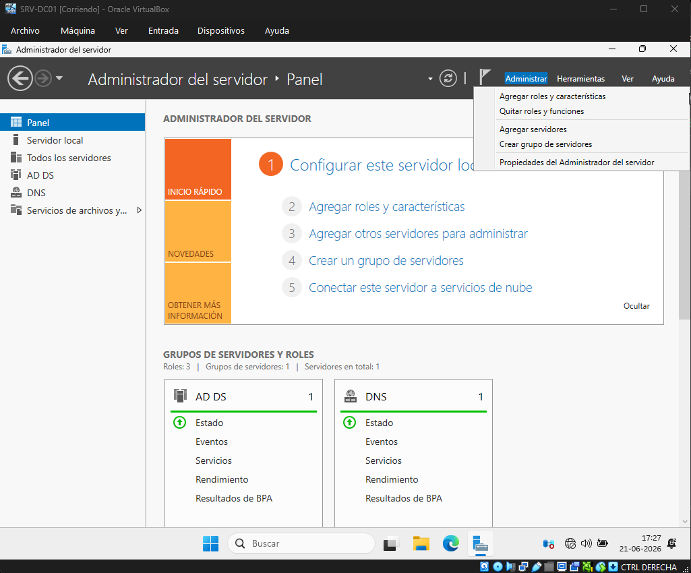

2. En la sección **Roles del servidor**, se selecciona la opción **Servidor DHCP**.
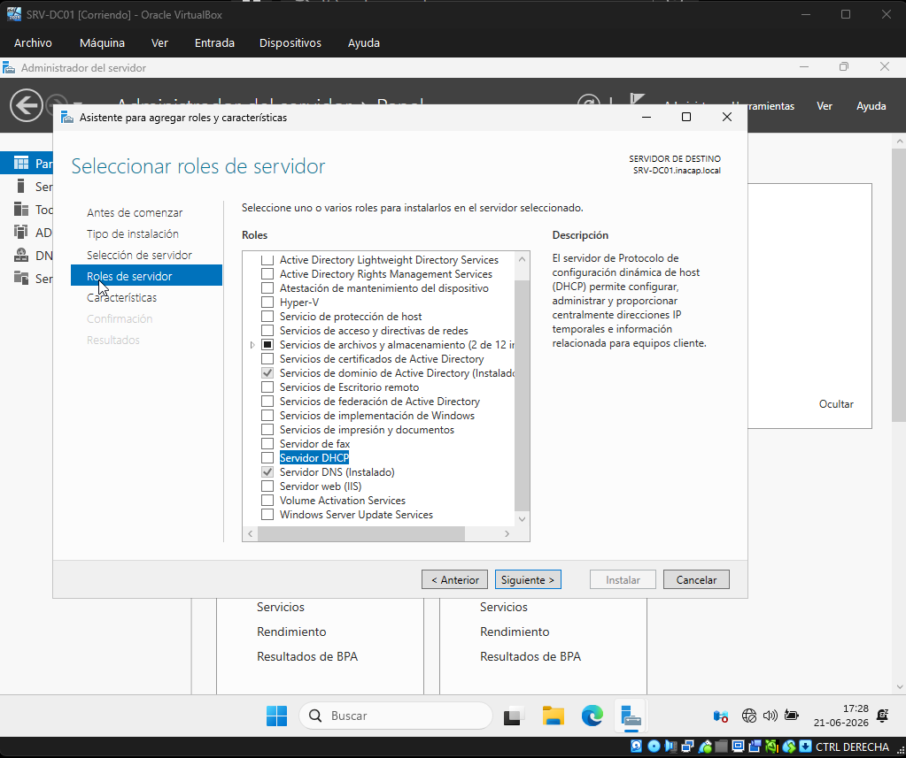

3. Se validan las características adicionales que serán incorporadas y se selecciona la opción **Agregar características**.
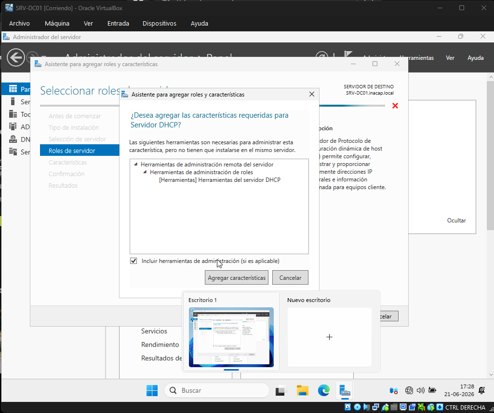

4. Se selecciona la opción **Instalar** y se espera a que finalice el proceso de instalación del rol DHCP.
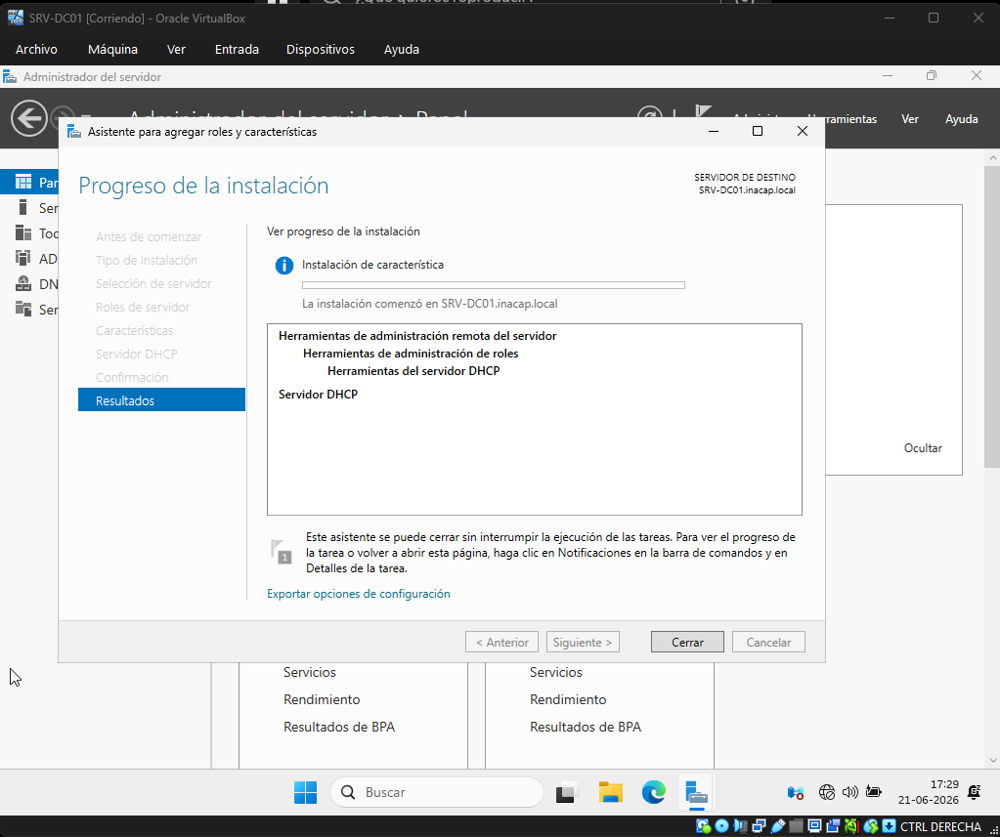

5. Una vez finalizada la instalación, se selecciona la bandera de notificaciones del **Administrador del servidor** y se ingresa a **Completar configuración de DHCP**.
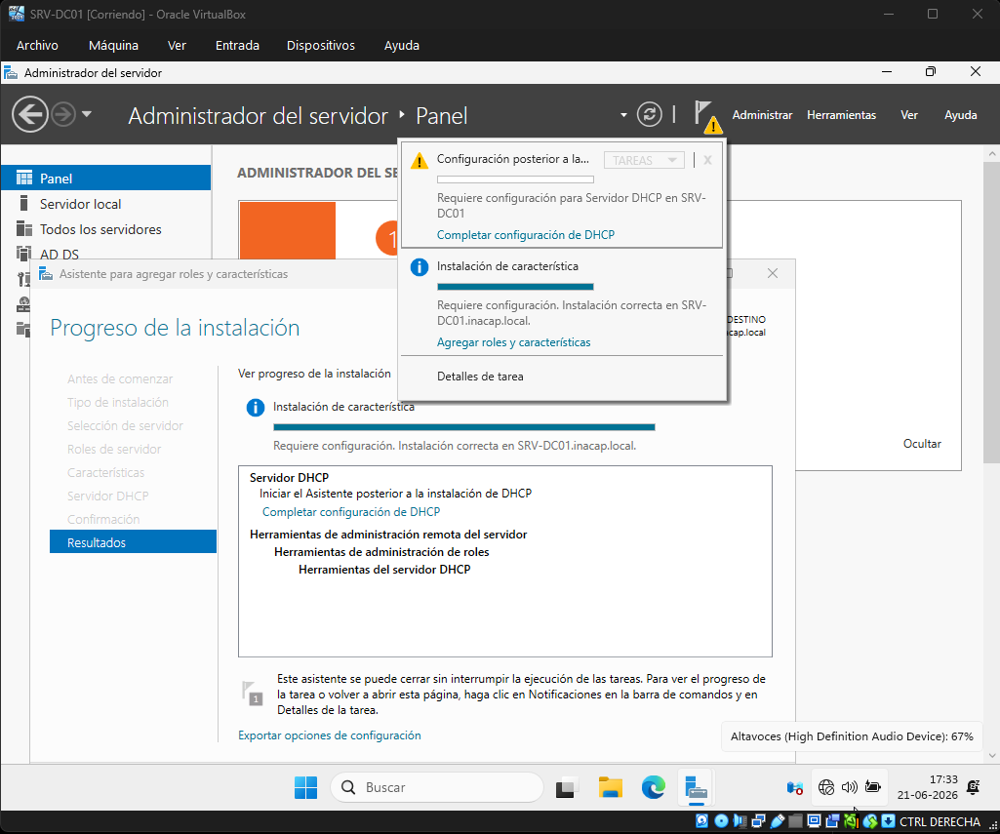

6. Se utilizan las credenciales del usuario **Administrador** para autorizar la configuración del servicio DHCP y finalizar el asistente.
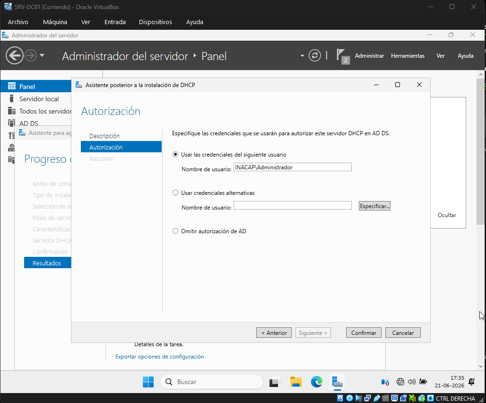

---

## Paso a Paso Creación del ámbito DHCP

Luego de instalar el rol DHCP, se abrió la consola desde `Herramientas → DHCP`:

Dentro de la consola DHCP, se expandió el servidor y se creó un nuevo ámbito en IPv4.

El ámbito configurado permite entregar direcciones IP automáticas a los clientes de la red `redlab`.

La configuración aplicada fue la siguiente:

| Parámetro         | Valor            |
| ----------------- | ---------------- |
| Nombre del ámbito | `LAN-redlab`     |
| Dirección inicial | `192.168.10.50`  |
| Dirección final   | `192.168.10.100` |
| Máscara de subred | `255.255.255.0`  |
| Servidor DNS      | `192.168.10.10`  |
| Dominio           | `inacap.local`   |

Paso a Paso:

1. Desde el menú **Herramientas**, se selecciona la opción **DHCP** para abrir la consola de administración del servicio.
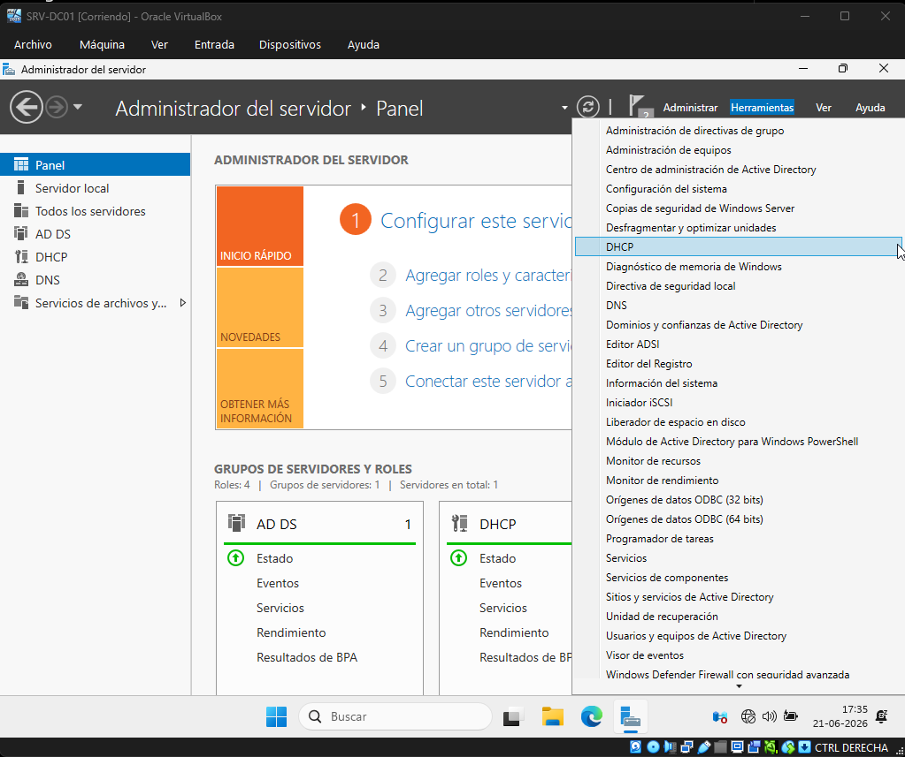

2. Dentro de la consola DHCP, se hace clic derecho sobre la opción **IPv4** y se selecciona **Nuevo ámbito**.
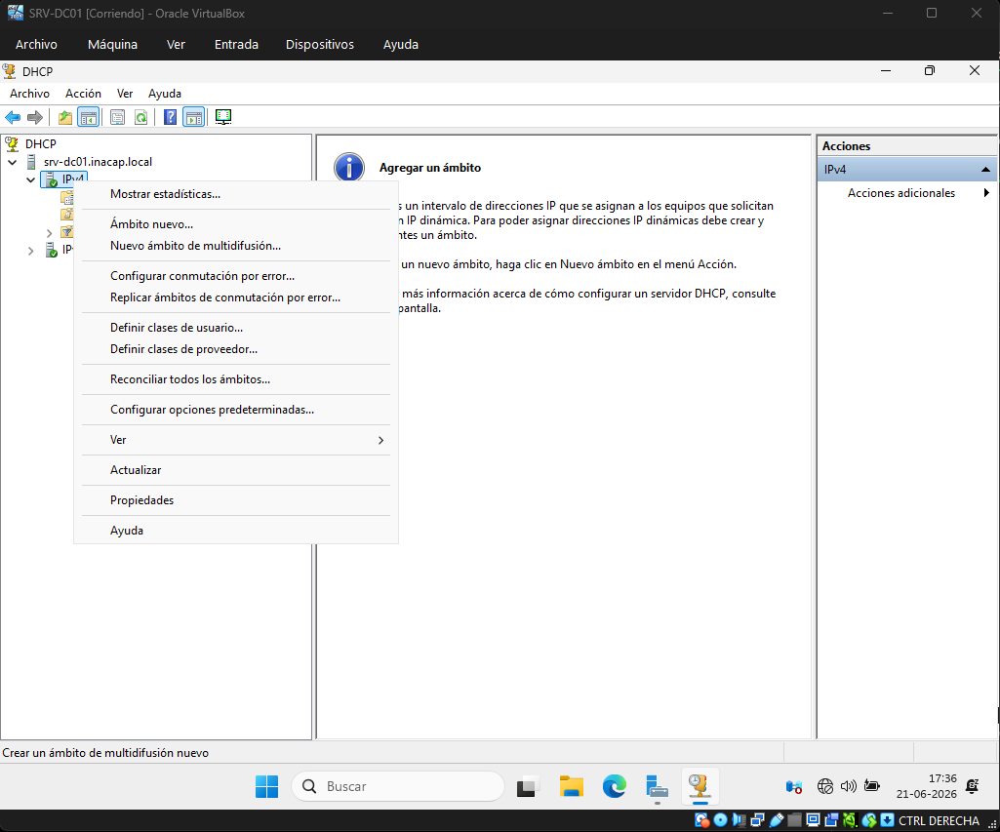

3. Se define el nombre del nuevo ámbito DHCP, de acuerdo con la red interna configurada para el laboratorio.
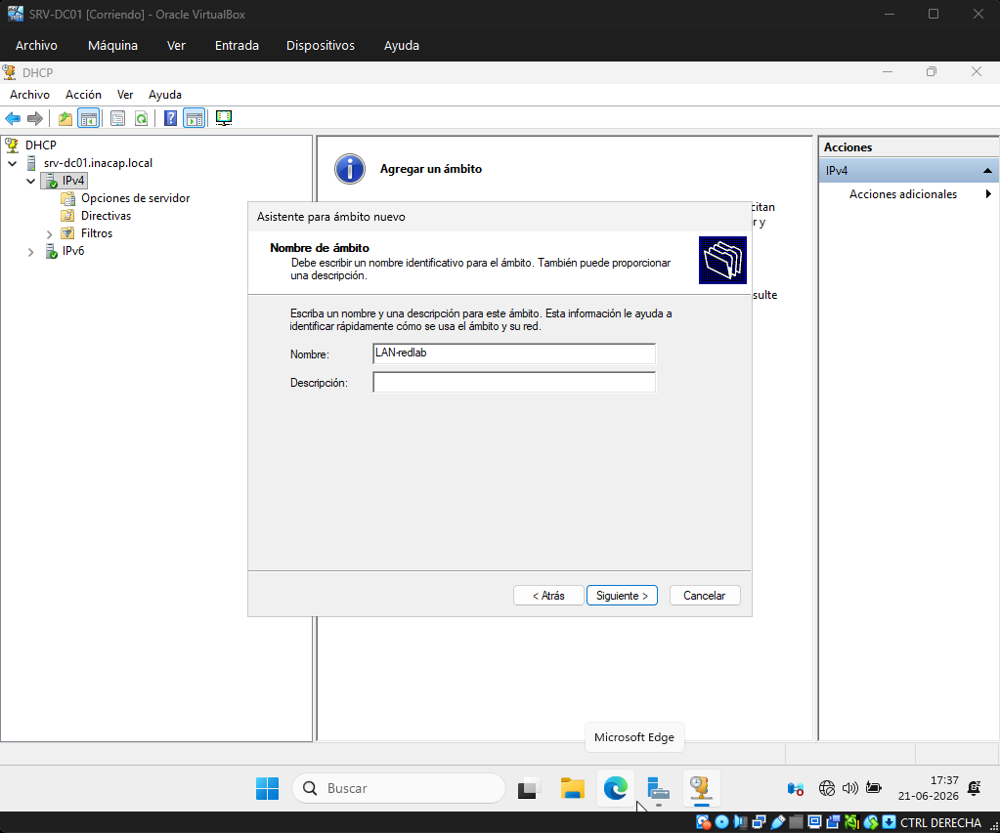

4. Se configura el intervalo de direcciones IP que será distribuido automáticamente a los equipos clientes.
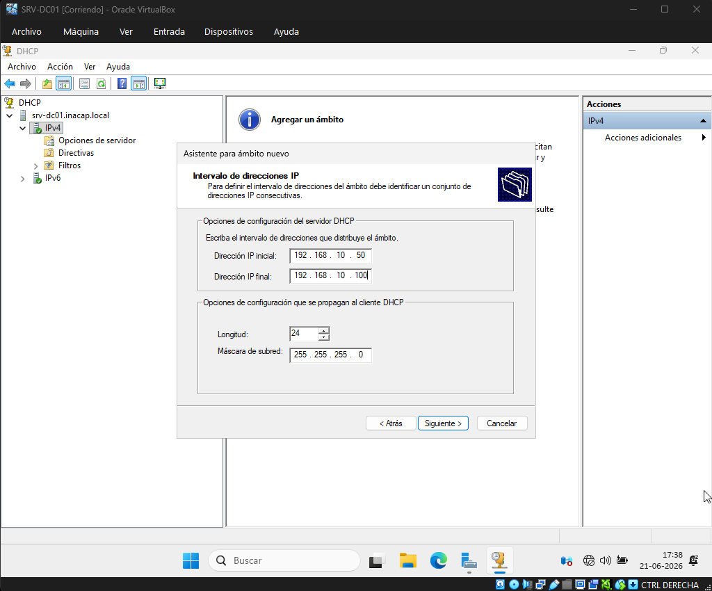

5. Finalmente, se verifica que el ámbito DHCP se encuentre activo, confirmando que la configuración fue completada correctamente.
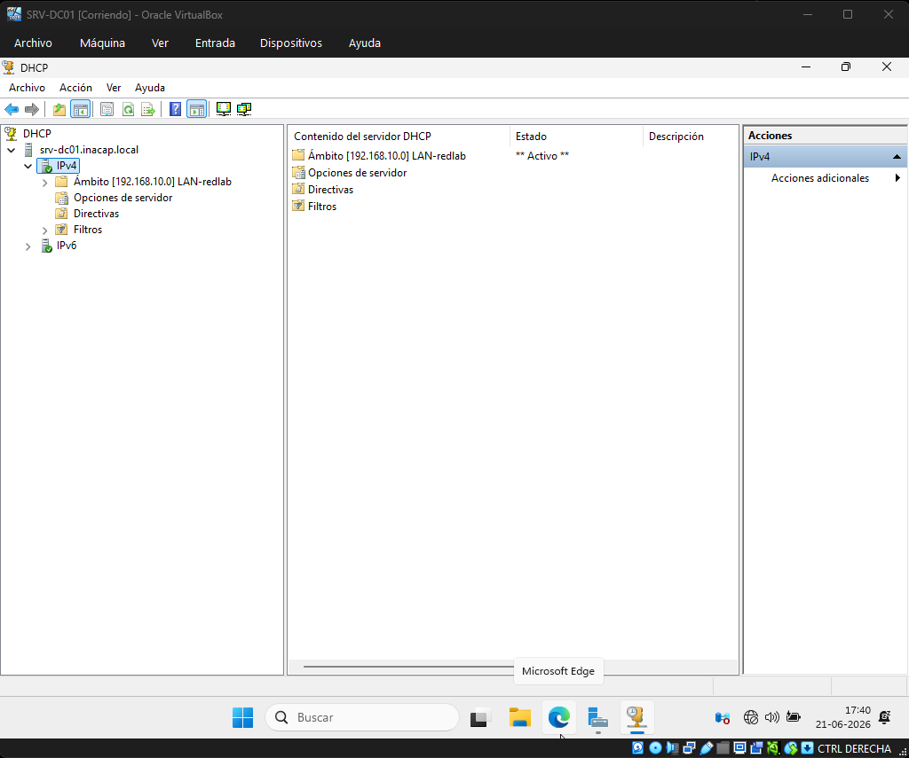

---

## Resultado de la configuración

Al finalizar esta etapa, el servidor `SRV-DC01` quedó configurado con los servicios DNS y DHCP activos.

El servicio DHCP quedó preparado para entregar direcciones IP automáticas dentro del rango `192.168.10.50` a `192.168.10.100`, mientras que el DNS quedó configurado para permitir la resolución del dominio `inacap.local`.
