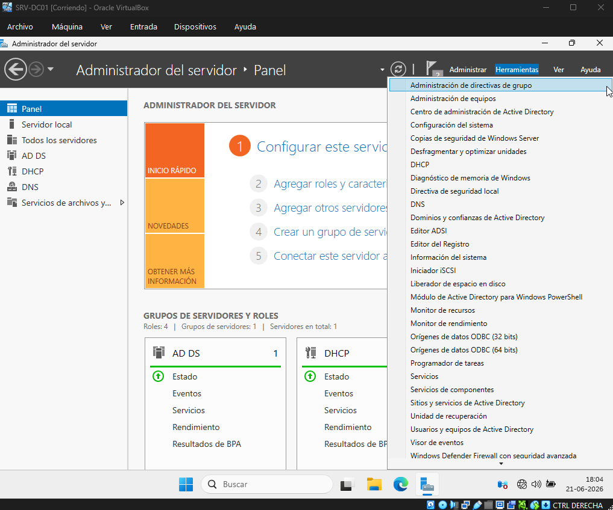
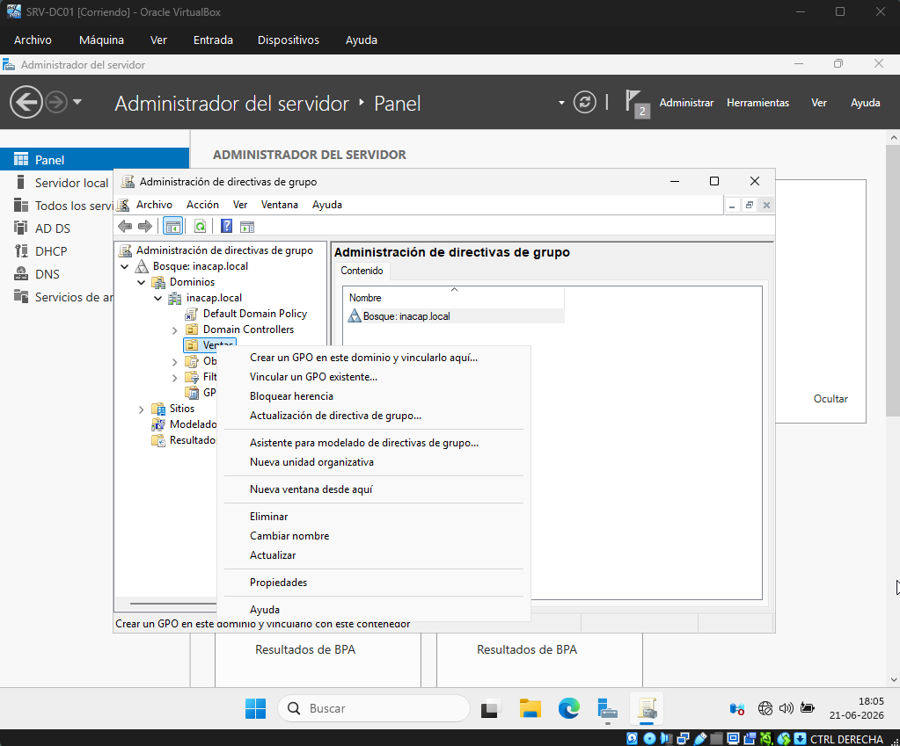
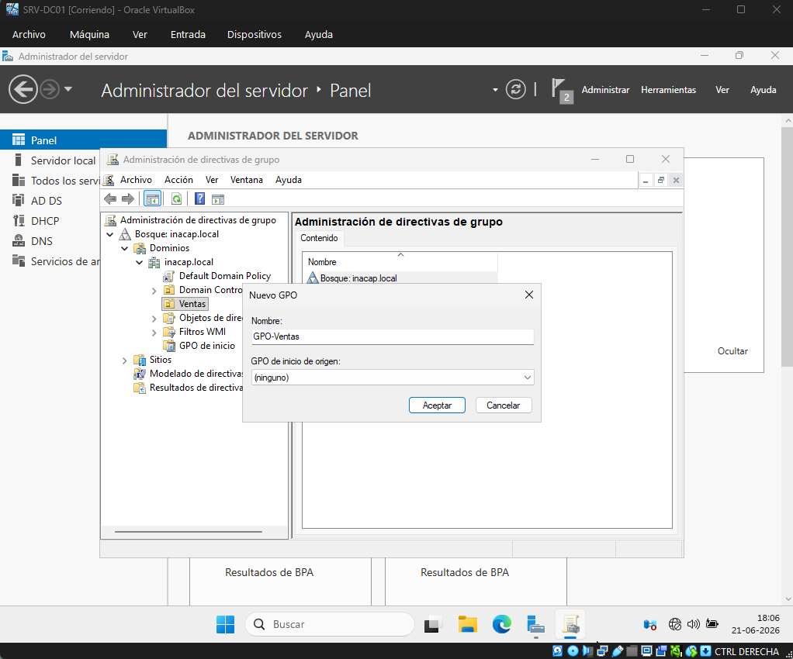
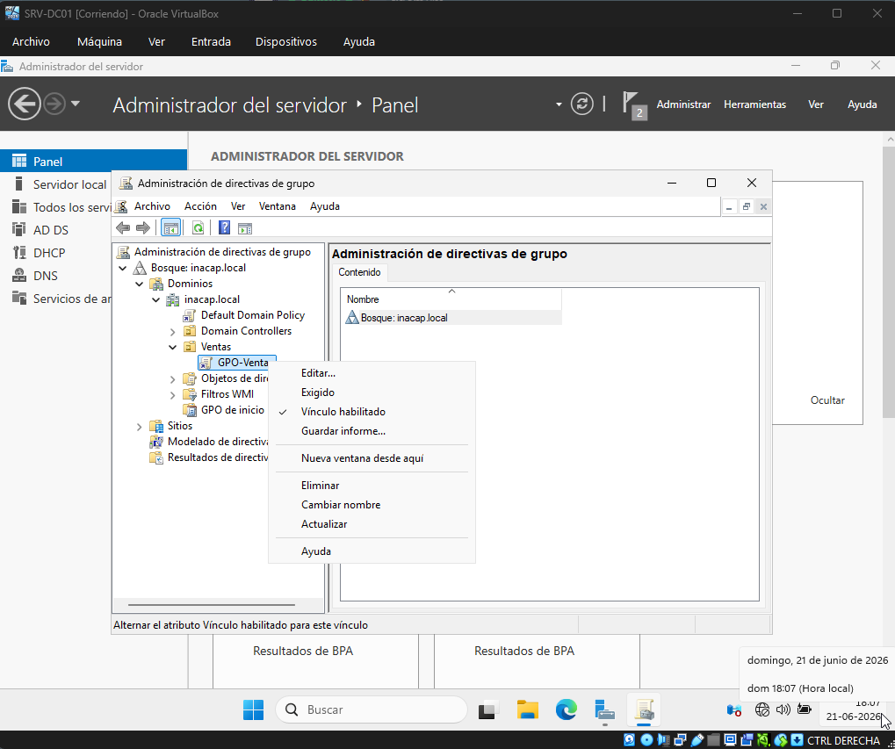
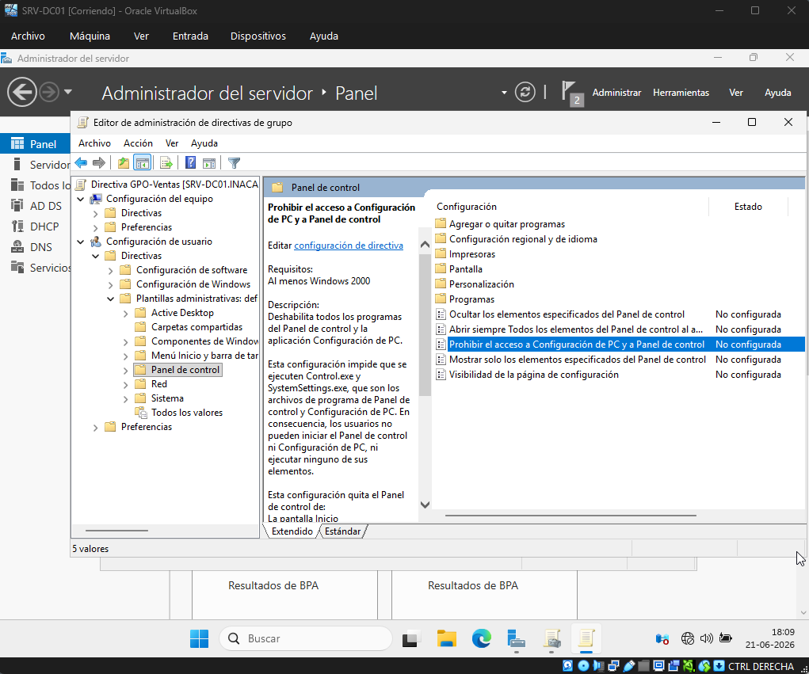
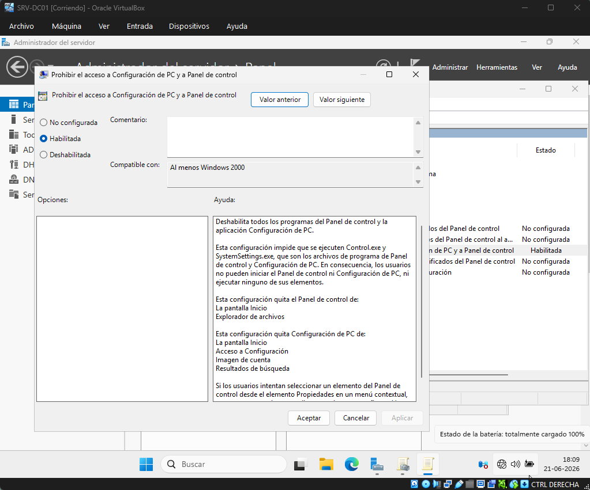
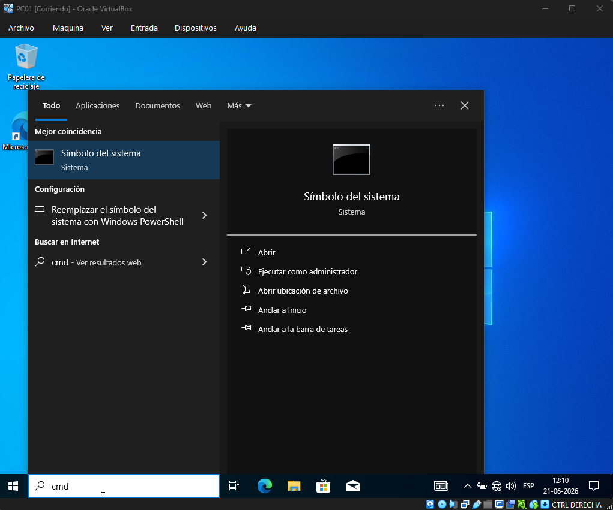
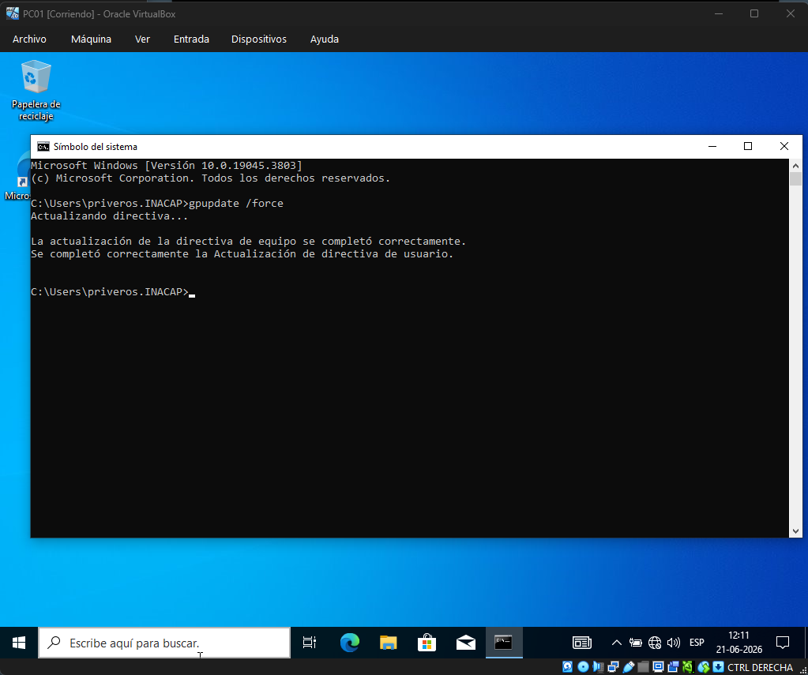
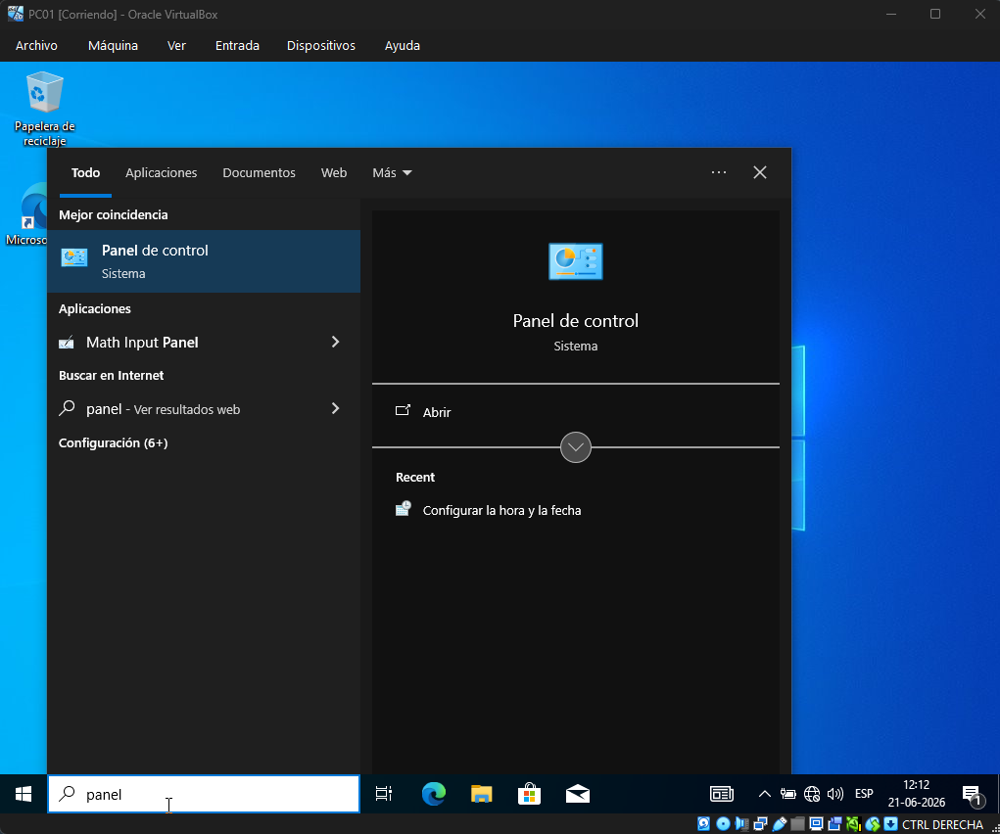
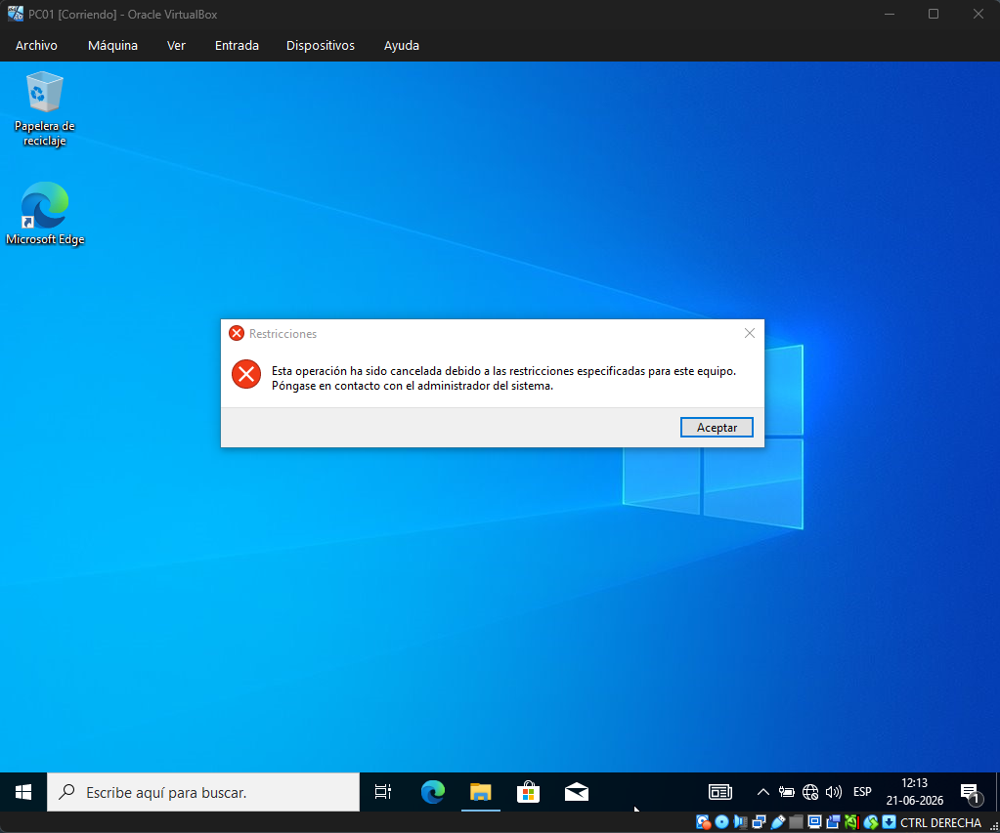

# Políticas de grupo GPO

## Objetivo de la sección

En esta sección se documenta la creación, vinculación y validación de una **Política de Grupo (GPO)** dentro del dominio `inacap.local`.

El objetivo es aplicar una configuración centralizada sobre los usuarios de la unidad organizativa `Ventas`, utilizando el servidor `SRV-DC01` como controlador de dominio.

La política configurada permite restringir el acceso al **Panel de control** y a la **Configuración de PC** en el equipo cliente `PC01`, comprobando así que las directivas del dominio se aplican correctamente sobre los usuarios.

---

## Datos generales de la GPO

| Elemento              | Configuración                                     |
| --------------------- | ------------------------------------------------- |
| Servidor              | `SRV-DC01`                                        |
| Dominio               | `inacap.local`                                    |
| Unidad organizativa   | `Ventas`                                          |
| Nombre de la GPO      | `GPO-Ventas`                                      |
| Tipo de configuración | Configuración de usuario                          |
| Restricción aplicada  | Bloqueo de Panel de control y Configuración de PC |
| Cliente de prueba     | `PC01`                                            |
| Usuario de prueba     | `INACAP\rivpat`                                   |

---

## Paso a Paso Creación de la GPO

Dentro de la consola de Administración de directivas de grupo, se ubicó la unidad organizativa `Ventas`.

Luego se seleccionó la opción para crear una nueva GPO `GPO-Ventas` en este dominio y vincularla directamente a la OU.

Vincular la GPO a la OU permite que la configuración se aplique a los usuarios o equipos contenidos dentro de dicha unidad organizativa.

Paso a Paso:

1. Desde el menú **Herramientas**, se selecciona la opción **Administración de directivas de grupo**.


2. Dentro del administrador, se selecciona la unidad organizativa `Ventas` y se crea una nueva GPO en este dominio, vinculándola directamente a dicha unidad organizativa.


3. Se define el nombre de la nueva GPO como `GPO-Ventas`.


---

## Paso a Paso Edición de la GPO

Luego de crear la política, se hizo clic derecho sobre `GPO-Ventas` y se seleccionó la opción **Editar**.

Dentro del editor de directivas, se ingresó a la siguiente ruta:

```text
Configuración de usuario
→ Directivas
→ Plantillas administrativas
→ Panel de control
```

En esta sección se habilitó la política `Prohibir el acceso al Panel de control y a la configuración de PC`:

Esta configuración impide que el usuario pueda abrir el Panel de control o acceder a la configuración del sistema desde el cliente.

Paso a Paso:

1. Una vez creada la GPO, se hace clic derecho sobre `GPO-Ventas` y se selecciona la opción **Editar**.


2. Dentro del editor de directivas, se accede a la configuración correspondiente para definir restricciones de usuario. En este caso, se configurará la restricción de acceso al **Panel de control** y a la **Configuración de PC**.


3. Se habilita la directiva **Prohibir el acceso al Panel de control y a la configuración de PC**.


---

## Paso a Paso Aplicación de la política en el cliente

En el equipo cliente `PC01`, se inició sesión con el usuario del dominio `INACAP\rivpat`.

Para forzar la actualización de las políticas de grupo, se abrió una ventana de comandos y se ejecutó `gpupdate /force`.

Luego se cerró la sesión y se volvió a iniciar sesión con el mismo usuario del dominio para asegurar que la política quedara aplicada correctamente.

Paso a Paso:

1. Para validar el funcionamiento de la GPO, se inicia sesión en el equipo cliente `PC01` con el usuario de dominio y se intenta acceder al **Panel de control**.


2. Se ejecuta el comando `gpupdate /force` para forzar la actualización de las directivas de grupo en el equipo cliente.


3. Se reinicia el equipo cliente y se intenta abrir nuevamente el **Panel de control** para validar que la restricción se encuentre aplicada.


4. Se visualiza el mensaje de restricción, lo que confirma que la GPO fue aplicada correctamente sobre el usuario del dominio.


---

## Resultado de la configuración

Al finalizar esta etapa, se creó y vinculó correctamente la GPO `GPO-Ventas` sobre la unidad organizativa `Ventas`.

Además, se comprobó desde el cliente `PC01` que el acceso al Panel de control y a la Configuración de PC quedó restringido para el usuario del dominio.
